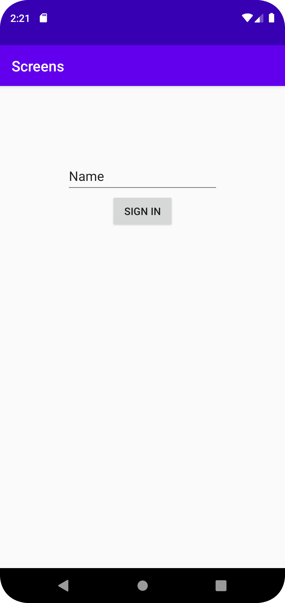

# Rapport

Har skapat en ny activity vid namn ProfileActivity. Skapade även en knapp som är placerad inom MainActivity. Genom att ange onClickListener som lyssnar efter 
att användaren har tryckt på knappen. Då skapas ett nytt intent som kommer att ta användaren till ProfileActivity.


```
@Override
    protected void onCreate(Bundle savedInstanceState) {
        super.onCreate(savedInstanceState);
        setContentView(R.layout.activity_main);


        final Button button = findViewById(R.id.signin_button);
        button.setOnClickListener(new View.OnClickListener() {
            @Override
            public void onClick(View view) {
                Intent intent = new Intent(MainActivity.this, ProfileActivity.class);
                startActivity(intent);
            }
        });
    }
    
@Override
    protected void onCreate(Bundle savedInstanceState) {
        super.onCreate(savedInstanceState);
        setContentView(R.layout.activity_profile);

        Intent intent = getIntent();
    }
```

Bilder läggs i samma mapp som markdown-filen.




